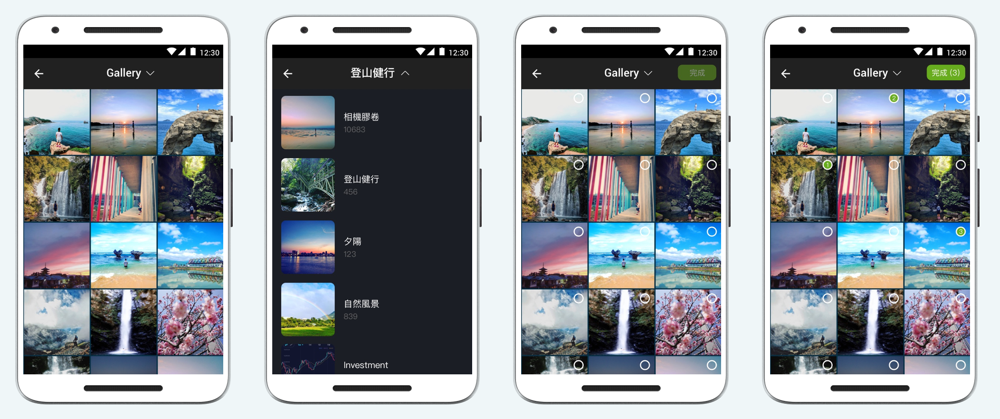

## GalleryEngine

GalleryEngine is an Android custom gallery library that users can select images/videos with different conditions such as image file size, video duration limit. This projects is implemented with MVVM, RxJava, you can learn more with [my blog post](https://enginebai.com/2019/10/07/android-gallery/).




## Usage

**Remember to request permission `READ_EXTERNAL_STORAGE` in AndroidManifest.xml and Runtime.**

```kotlin
GalleryEngine.Builder()
    .choose(MimeType.ALL)       // Media type to select: ALL/IMAGE/VIDEO, default = MimeType.ALL
    .multiple(true)             // support multiple selection, default = false
    .maxSelect(5)               // max number of selection, support in multiple selection mode only
    .imageMaxSize(1024)         // max image file size in KB, support image mode only
    .videoMaxSecond(60)         // max video duration in second, support video mode only
    .videoMinSecond(3)          // min video duration in second, support video mode only
    .forResult(this, REQUEST_SELECT_MEDIA)  // start gallery and specify the request code

```

## Get Selected Media
In `Activity` or `Fragment`, to override `onActivityResult()` and pass `data: Intent?` to `GalleryEngine.getSelectMediaPaths(data)` to get the selected media path list:

```kotlin
override fun onActivityResult(requestCode: Int, resultCode: Int, data: Intent?) {
    super.onActivityResult(requestCode, resultCode, data)
    if (requestCode == REQUEST_SELECT_MEDIA && resultCode == Activity.RESULT_OK) {
        Toast.makeText(this, GalleryEngine.getSelectMediaPaths(data).toString(), Toast.LENGTH_SHORT).show()
    }
}
```


## LICENSE

The MIT License

Copyright © 2019 Engine Bai.

Permission is hereby granted, free of charge, to any person obtaining a copy
of this software and associated documentation files (the "Software"), to deal
in the Software without restriction, including without limitation the rights
to use, copy, modify, merge, publish, distribute, sublicense, and/or sell
copies of the Software, and to permit persons to whom the Software is
furnished to do so, subject to the following conditions:

The above copyright notice and this permission notice shall be included in
all copies or substantial portions of the Software.

THE SOFTWARE IS PROVIDED "AS IS", WITHOUT WARRANTY OF ANY KIND, EXPRESS OR
IMPLIED, INCLUDING BUT NOT LIMITED TO THE WARRANTIES OF MERCHANTABILITY,
FITNESS FOR A PARTICULAR PURPOSE AND NONINFRINGEMENT. IN NO EVENT SHALL THE
AUTHORS OR COPYRIGHT HOLDERS BE LIABLE FOR ANY CLAIM, DAMAGES OR OTHER
LIABILITY, WHETHER IN AN ACTION OF CONTRACT, TORT OR OTHERWISE, ARISING FROM,
OUT OF OR IN CONNECTION WITH THE SOFTWARE OR THE USE OR OTHER DEALINGS IN
THE SOFTWARE.